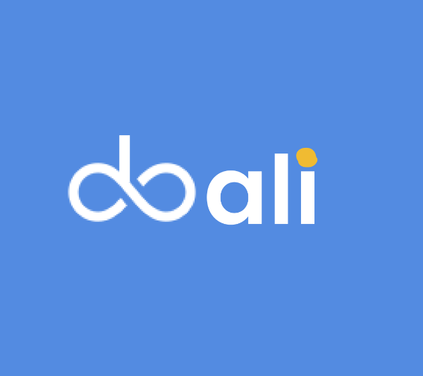

# DOALI 🌟

## Visão Geral
O **Doali** é uma plataforma inovadora dedicada a facilitar a conexão entre doadores e ONGs que recebem doações. Desenvolvido durante a disciplina de Programação Web, ministrada pelo Professor José Roberto no curso Técnico em Informática do IFCE, o Doali visa proporcionar um espaço de interação e colaboração.

## O Que Fazemos
♾ **Conexão Consciente**: O Doali permite que você consulte ONGs receptoras de doações com base na sua localização ou pelo nome da instituição, caso já tenha um em mente.

💬 **Interação e Colaboração**: Nossa plataforma oferece um espaço para que doadores e instituições carentes possam trocar informações, promovendo doações de maneira consciente e colaborativa.

## Desenvolvimento 

  
  

    
 💻 O Doali é desenvolvido utilizando:

    <ul>
      <li><strong>Node.js</strong> para desenvolvimento web;</li>
      <li><strong>EJS</strong> (Embedded JavaScript Templating) como template engine.</li>
    </ul>
    
🛠 <strong>IDE utilizada:</strong> Replit

    
🏗 <strong>O projeto está na primeira etapa de desenvolvimento e sujeito a modificações.</strong>

  

## Como Funciona
1. **Pesquise ONGs**: Utilize nossa funcionalidade de busca para encontrar ONGs próximas a você ou pelo nome.
2. **Interaja**: Conecte-se com outras pessoas e instituições para compartilhar informações e experiências sobre doações.
3. **Doe Conscientemente**: Faça suas doações com a certeza de que está ajudando a quem realmente precisa.

